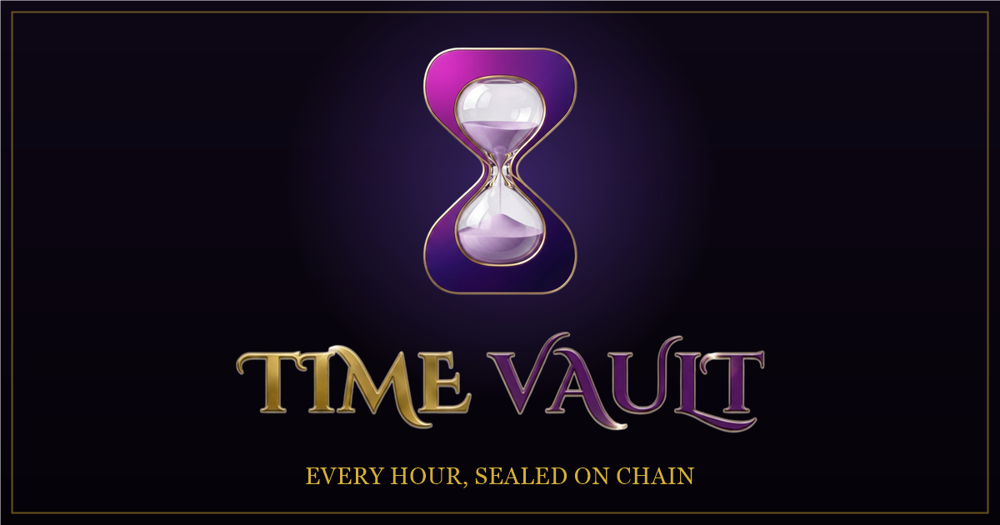

# Time Vault ($TV)

**Every Hour, Sealed on Chain.** · [**timevault.tv**](https://timevault.tv)


-8B5CF6?labelColor=0A0512)

Time Vault is an AI-powered tokenized proof-of-service marketplace. Freelance
hours become tradable Service NFTs, buyer funds lock in escrow before work
begins, and seven AI agents handle pricing, verification, matching, reputation,
and disputes.



## The token

```
0xEAe2a144A3C7CFd4Ea50b9F5513124048Fed8bcc
```

[View on the explorer](https://www.letscash.fun/token/0xEAe2a144A3C7CFd4Ea50b9F5513124048Fed8bcc)
· 100% of supply into the liquidity pool · 0% held by the creator · liquidity
locked · 3% trading tax.

That is the only address. Every figure on the site is read from the chain at page
load rather than typed into the HTML, so it can be checked against the explorer
at any time. [timevault.tv/proof](https://timevault.tv/proof) lays out each claim
next to the thing that proves it.

## What is built, and what is not

The token is live. The protocol around it is not, and the site says so in the
same breath rather than in a footnote.

**Working today**

- Seven agents answering on a real model, through a backend that keeps the API
  key server-side. Ask them anything; the replies are generated, not scripted.
- Live chain figures across the landing page, the app and the proof page: market
  cap, holders, 24h volume, recent trades, and a price chart, all from the
  letscash.fun public API.
- The full interface: browse, mint, orders, disputes, agent console, profile.

**Not built yet**

- The escrow contract. No user funds move anywhere in this project.
- Service NFT minting. The mint form builds a live card preview and stops there.
- Settlement, dispute resolution, and verification contracts.

The marketplace is a demonstration of the interface. Skill Scores and order
history in the app are demo data and are labelled as such.

## Pages

| Page | File | What it is |
|------|------|------------|
| Landing | `index.html` | Brand intro, agent cards, cursor-reactive particle field, live token figures |
| App | `app.html` | Vault Overview, Browse, Mint, My Orders, Dispute Center, Agent Console, My Profile |
| Whitepaper | `whitepaper.html` | Protocol architecture, Service NFT lifecycle, tokenomics, roadmap |
| Proof | `proof.html` | Every claim next to what verifies it, including what is not built |
| Not found | `404.html` | Branded 404, served by nginx for any wrong address |

The live site serves these without the `.html`: `/app`, `/whitepaper`, `/proof`.

## The seven agents

| Agent | Role |
|-------|------|
| LYRA | Concierge and onboarding |
| VORIAN | Escrow arbiter and dispute resolution |
| NERIS | Reputation engine (Skill Score) |
| SOLON | Pricing oracle |
| KAIROS | Delivery verification (Confidence Score) |
| ATLAS | Talent scout and matching |
| CIRION | Treasury manager |

All seven answer live. `server/agents.py` holds their personas and the facts they
are allowed to state; an agent that invents tokenomics is worse than no agent, so
the prompt pins them to what is on the site.

## Run locally

Any static server works. There is no build step.

```bash
npx http-server . -p 8080
```

Everything is vanilla HTML, CSS and JS. Three.js and Google Fonts load from CDN.
The agent console and the live figures need the backend, so locally they fail
gracefully rather than showing anything invented.

## Project structure

```
├── index.html            # Landing page
├── app.html              # dApp interface
├── whitepaper.html       # Whitepaper
├── proof.html            # What is verifiable, and what is not built
├── 404.html              # Branded not-found page
├── assets/
│   ├── logo.png          # Emblem (web-optimized)
│   ├── logo-name.png     # Wordmark
│   ├── favicon.png       # Square favicon
│   ├── og.png            # Social share image (1200x630)
│   ├── agents/           # Seven agent portraits (web-optimized)
│   ├── video/            # Compressed brand animations (H.264)
│   └── js/               # agent-menu, vault-notes, wallet-connect, tv-auth, tv-live
├── server/               # Agent backend (Python, stdlib HTTP) + systemd unit
├── deploy/               # nginx vhost, deploy runbook, vhost patches, smoke test
├── marketing/            # Social banner templates, render and video scripts
└── source/
    ├── brand/            # Original brand masters (uncompressed)
    └── agents/           # Original agent art masters
```

## Deploying

`deploy/DEPLOY.md` is the runbook. Two things in it are worth knowing before you
touch a live server:

- `deploy.sh` is first-install only. On a running server it overwrites the vhost
  and deletes the `listen 443 ssl` block certbot owns, taking HTTPS down while
  Cloudflare keeps serving cached pages, so the outage is easy to miss. Use the
  `patch-*.sh` scripts instead; they edit in place, test, and roll back.
- `bash deploy/smoke.sh` checks the live site end to end afterwards, including
  asking an agent a real question, and exits non-zero if anything is wrong.

## Roadmap

The full version is in the [whitepaper](whitepaper.html). In short:

1. **Smart contracts**: Service NFT (ERC-721) and Escrow Vault to testnet, then audit
2. **Backend**: persistent marketplace, orders, and disputes
3. **Robinhood Chain** integration as the network becomes publicly available

## Contributing

See [CONTRIBUTING.md](CONTRIBUTING.md). Security issues go through the private
channel described in [SECURITY.md](SECURITY.md), not a public issue.

---

**Nothing here is financial advice.** $TV is a token with a live market and real
downside. Read [the proof page](https://timevault.tv/proof), check the contract
yourself, and decide for yourself.

© 2026 Time Vault. Every Hour, Sealed on Chain.
